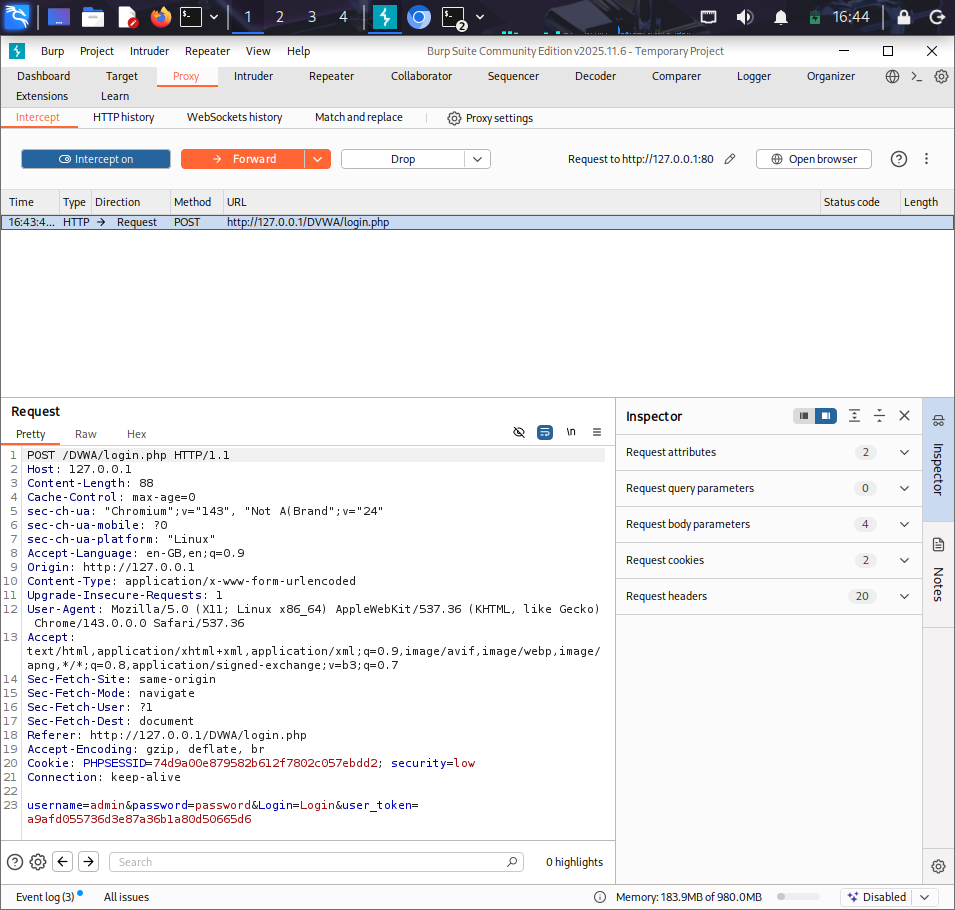
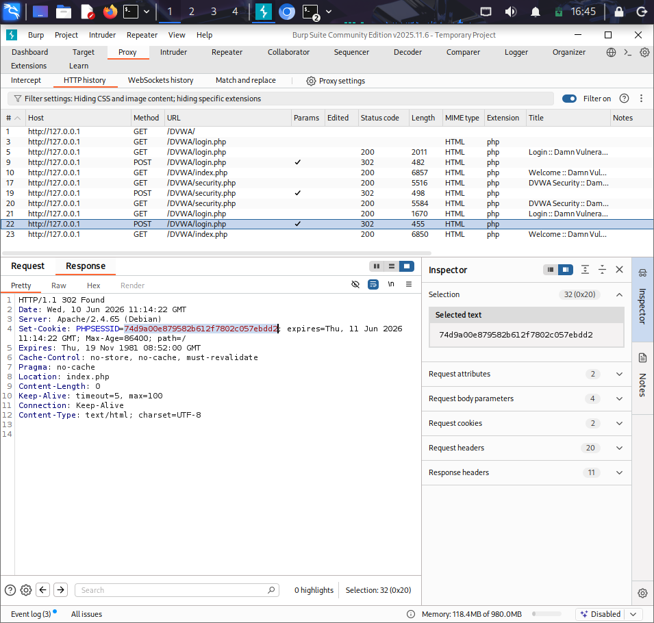
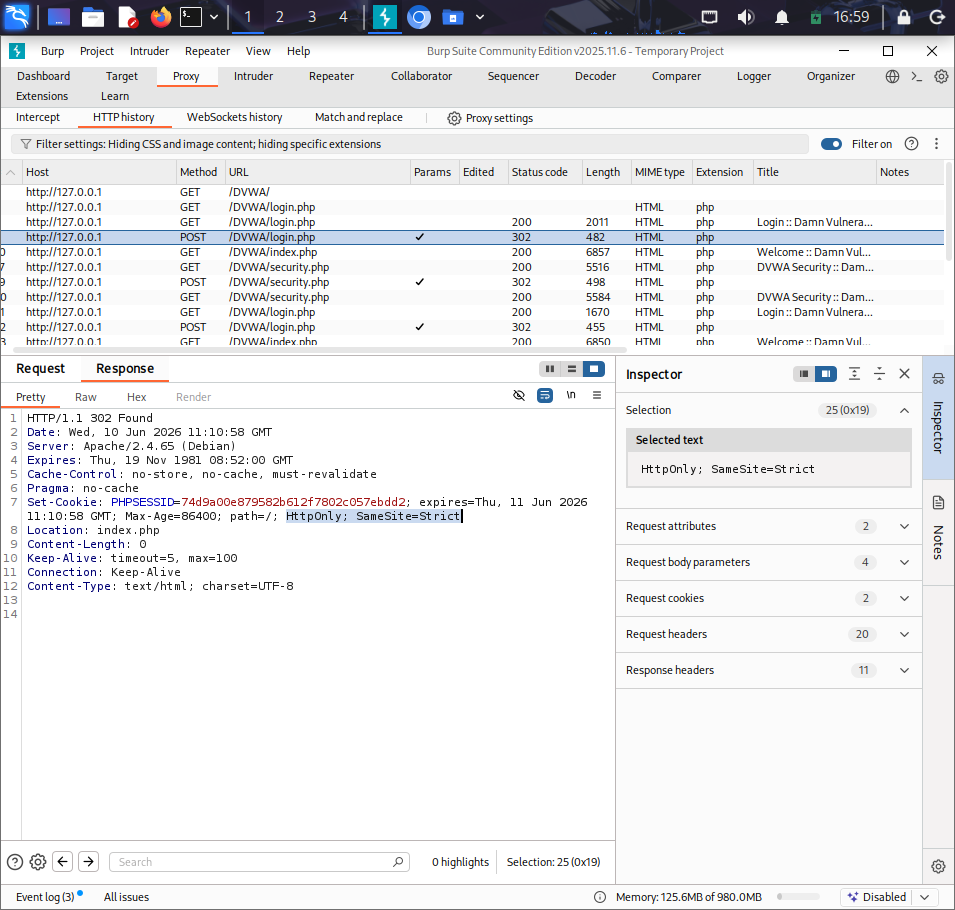
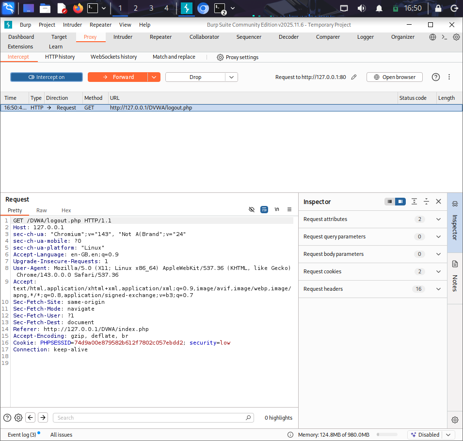
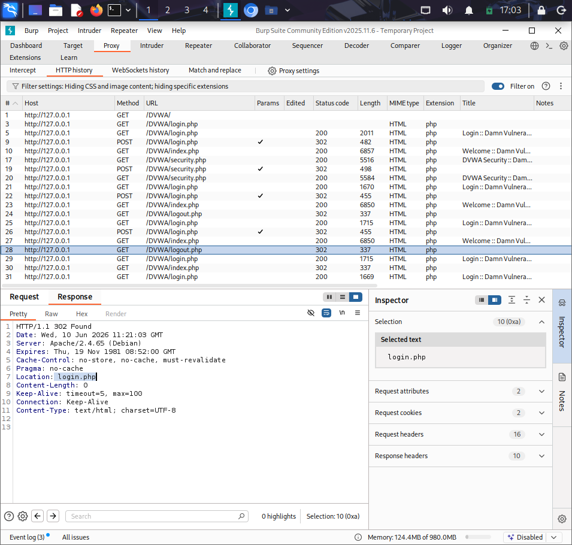

# Burp Suite Project 4 – Session Management & Authentication Analysis

## Overview

This project focuses on analyzing authentication mechanisms and session management within DVWA (Damn Vulnerable Web Application) using Burp Suite.

The objective was to observe how login requests are processed, how session cookies are generated and maintained, and how the application handles logout and access control.

---

## Objectives

- Analyze authentication requests and responses
- Examine session cookie behavior
- Review session handling after login and logout
- Verify access control mechanisms
- Understand how web applications manage authenticated sessions

---

## Methodology

### 1. Authentication Request Analysis

The login request was intercepted using Burp Suite Proxy.

Observed:

- HTTP Method: POST
- Username parameter
- Password parameter
- Session cookie generation

### 2. Session Cookie Inspection

After successful authentication, the response was analyzed to identify:

- PHPSESSID cookie
- Cookie attributes
- Session persistence

### 3. Logout Analysis

The logout request was intercepted and examined to determine how the application terminates active sessions.

### 4. Access Control Verification

After logout, attempts were made to access authenticated pages directly to verify whether access restrictions were properly enforced.

### 5. Session Comparison

Session identifiers before and after authentication were compared to understand session handling behavior.

---

## 🔍 Findings

### Finding 1

Authentication credentials are transmitted through an HTTP POST request.

### Finding 2

DVWA uses the PHPSESSID cookie to maintain authenticated user sessions.

### Finding 3

The application redirects unauthenticated users to the login page when attempting to access protected resources.

### Finding 4

Logout functionality terminates the active authenticated session.

---

## Screenshots

The following screenshots were captured during testing:

1. Login Request

2. Login Response

3. Session Cookie Analysis

4. Logout Request

5. Logout Response

---

## Skills Demonstrated

- HTTP Request Analysis
- HTTP Response Analysis
- Authentication Testing
- Session Management Analysis
- Cookie Inspection
- Access Control Verification
- Burp Suite Traffic Analysis
- Security Documentation

---

## Conclusion

This assessment demonstrated how DVWA manages user authentication and session tracking through cookies. The project provided practical experience in analyzing HTTP traffic, identifying session-related components, and understanding how web applications maintain authenticated user access.
